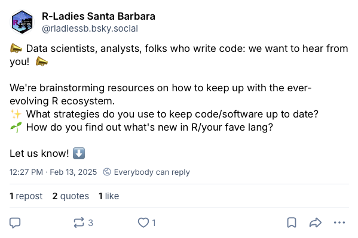
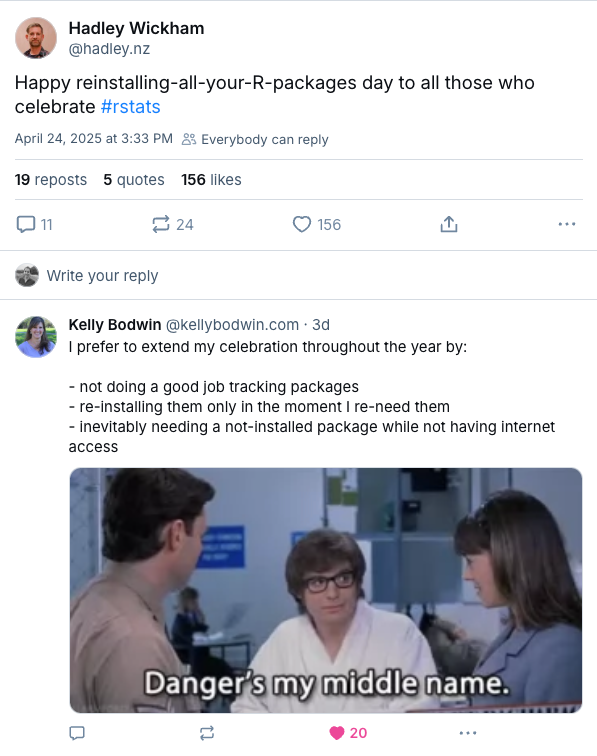
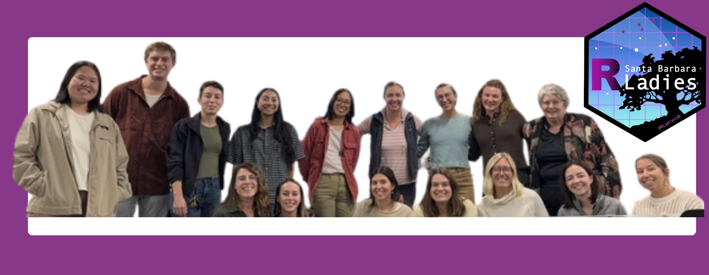

::: {.small-text .center-text}
<sup>*</sup>denotes the R-Ladies Santa Barbara co-organizing team, <sup>+</sup>indicates contributors to the writing and editing of this blog post. All others participated in the R-Ladies Santa Barbara Meetup discussion that inspired the content of this post.
:::

<br>

::: {.larger-text .center-text}
*This blog post is cross-posted from the [R-Ladies Global blog](https://rladies.org/blog/).* ***[UPDATE LINK ONCE AVAILABLE]***
:::

<br>

## We've all been there –

Have you ever returned to an old R project only to realize that your code no longer runs? Perhaps your code still runs, but now you’re getting a bunch of “Warning: this function is deprecated,” messages in your console. Or maybe you’re working on a new project and want to download an exciting new package or feature, but your version of R isn’t compatible. Life moves fast in the R world – sometimes, it feels impossible to stay on top of the ever-expanding ecosystem of packages, tools, and features that make R so great. 

These moments are what sparked a conversation amongst the R-Ladies Santa Barbara co-organizers. As we reflected on these questions ourselves, we agreed that these situations are likely pretty common in the data science world and were a perfect topic for an R-Ladies event. And, perhaps unsurprisingly for a group of millennials, we gave this idea a hashtag: **#stayrelevant**.

We went searching for clear, practical guidance on how folks actually stay up to date with changes in the R ecosystem…and came up mostly empty. We even asked our communities on social media, and got *crickets*. 

```{r}
#| eval: true 
#| echo: false
#| fig-align: "center"
#| out-width: "75%" 

```

::: {.center-text .extra-small-text .gray-text}
Our attempt to crowdsource on Bluesky.
:::

At one point, we almost left this event idea on the back burner permanently. But we were encouraged and inspired by what we did find: lots of folks in our data science communities could relate to these challenges and were genuinely interested in hearing how others keep their code and workflows current. Some quotes:

>*“I would love to hear people’s responses to this because I always feel behind! I do try to follow a few people/orgs on social media to try and see when new things come out…but I don’t always get the new features into my code.” *

>*“ooooh, great questions! I can’t wait to hear what folks say!”  *

>*“I ran some R code again after not looking at it for <2 years and encountered multiple tidyverse deprecation warnings…Not even 2 years!...If I were to keep working on that project in earnest, I would want to be using the latest/greatest tidyverse, so updating my code would be required regardless.”*

```{r}
#| eval: true 
#| echo: false
#| fig-align: "center"
#| out-width: "55%" 

```

::: {.center-text .extra-small-text .gray-text}
Even R-celebs struggle with these challenges!
:::

Instead of trying to define a single “right” way to stay current in R, we decided to learn from our community through facilitated discussion. The goal of this blog post is to share what we learned from one another and distill this information into a set of considerations. There’s no one-size-fits-all approach for all R users – what works will look different depending on your goals, experience, and context. We hope these ideas help you find an approach that works for you!  

## Who are we?

```{r}
#| eval: true 
#| echo: false
#| fig-align: "center"
#| out-width: "75%" 

```

::: {.center-text .extra-small-text .gray-text}
R-Ladies Santa Barbara members at our November 2025 meetup!
:::

We are a community of R enthusiasts connected through [R-Ladies Santa Barbara](https://www.meetup.com/rladies-santa-barbara/){target="_blank"}, representing a range of career stages, sectors, and experience levels. Our contributors include academic staff, researchers, educators, industry practitioners, and data science learners. Collectively, our self-identified R experience ranges from novice to proficient.

Our recommendations emerge from this collective mix of experience and perspectives. While we don’t claim to represent all R users or all use cases, we aimed 
to surface common challenges and practical considerations shared across our communities. By convening under R-Ladies Santa Barbara, we grounded this work in the values of inclusivity and community-driven knowledge building.

## Our process

In fall 2025, R-Ladies Santa Barbara brought together participants for a [facilitated discussion](https://www.meetup.com/rladies-santa-barbara/events/311739680/?eventOrigin=group_upcoming_events){target="_blank"} on how to #stayrelevant. We began our meeting by outlining our motivation for the discussion, and then divided the 16 participants (including R-Ladies Santa Barbara co-organizers) into three ~equal-sized groups. Each group was assigned one of the following topics to discuss:

- Topic 1: Updating R and RStudio
- Topic 2: Updating packages and functions
- Topic 3: Transitioning to new tools (e.g. RStudio > Positron, R Markdown > Quarto)

Groups were provided the following minimal guidance ahead of discussion:

- No single “right” answer
- We aim to provide suggestions, rather than a prescriptive approach
- Consider your thoughts on:
    - When something is critical vs. not?
    - How do you weigh risks / tradeoffs before making a change (to code, tools, etc)

The topics rotated every 7 minutes so that each group had the opportunity to discuss all three topics. We worked in a collaborative Google Doc, where participants jotted down thoughts for each topic, added “+”s to ideas that resonated, and contributed new insights. Once all rotations were complete, each group used ChatGPT to generate a summary of their original topic and share it back with the collective group. 

Following the event, the R-Ladies Santa Barbara co-organizers worked together to organize the raw discussion points into key takeaways. We shared an outline with event participants, who collectively helped to write and edit the final version of this blog post.

## What do we mean by #stayrelevant?

Staying relevant in music may look like curating a playlist of new artists, or staying relevant in fashion may look like trying out a new style of jeans. But what does it mean to #stayrelevant in R programming? Well, it’s fundamentally not too different from staying relevant in music, fashion, or anything else. At a high level, staying relevant in R programming can mean being open to learning new information and being flexible to adapt your existing ‘style’ of coding to incorporate new trends, resources, or tools. 

For existing R projects, this can look like refactoring code to eliminate repetition, integrating a new R package that can help streamline a visualization, or simply keeping R and the supporting software up-to-date. For new R projects, this could look like testing out a new integrated development environment (IDE) as you develop the code or using Quarto documents if you have only ever used  RMarkdown files. Even if nothing in your code changes, staying relevant could also mean staying informed about the latest developments in the R ecosystem by tuning into a Posit conference session or scrolling through an R-focused newsletter.

Inspired by [PLOS’ Ten Simple Rules-style article format](https://collections.plos.org/collection/ten-simple-rules/){target="_blank"}, we’ve summarized our discussions into six overarching considerations to help us #stayrelevant.

## Six simple considerations to #stayrelevant

### 1. Who you’re working with matters 

Working alone may afford you the flexibility to experiment with new packages, tools or refactoring approaches. However, staying relevant doesn’t always happen in a vacuum, and the people you work with (collaborators, colleagues, clients, students, future you) can shape when and how it makes sense to update your approaches.

Making updates in a collaborative setting requires additional consideration: Are collaborators using the same version of R and operating system? Will everyone still be able to run the code? Could an update break a shared workflow right before a deadline? Asking these questions shouldn’t mean avoiding updates altogether, but they do encourage making thoughtful choices and prioritizing clear communication with collaborators.

Different work contexts may also call for different choices. For example, educators may update teaching code examples ahead of a course to reflect current package and function versions so that students are equipped with the most up-to-date information Alternatively, in client or organizational settings, decisions may be shaped by constraints such as IT-managed systems, security policies, or approved software lists, which may limit what you can update and when. In practice, how you choose to keep your R projects updated will be shaped by both the people you work with and the systems you work within.

<div class="dark-green-bg">**TRY THIS:** Use [`{renv}`](https://rstudio.github.io/renv/){target="_blank"} to manage project-specific package versions and improve reproducibility across collaborators. New to {renv}? Check out these [three great talks](https://github.com/shannonpileggi/practical-renv?tab=readme-ov-file#related-talks){target="_blank"} from posit::conf(2025), which offer a practical introduction and tips for successfully maintaining {renv}-backed projects (thanks, [Shannon Pileggi](https://github.com/shannonpileggi){target="_blank"}, for sharing these with us!)</div>

### 2. Update frequently and during natural project pauses 

Regardless of our jobs, industries, or coding comfort level, it may be best to avoid major software updates right before project deadlines to reduce the chance of breaking changes. However, potential headaches could be avoided entirely by routinely updating your software so that you’re not forced to make updates right at the “buzzer” when something is due. With more frequent updates, we leave ourselves with a smaller set of update-related issues to resolve, instead of paragraphs of error messages from a major overhaul of our workflow.

The idea of “frequent” and “natural pauses” can vary based on the project or person. For one person, a natural project pause might be after wrapping up work for the week, while for another it could be passing a completed analysis to a colleague for code review. Identifying these natural pauses within your current workflows can give you a clear idea of when to stop, drop (the mouse), and check for updates.

<div class="dark-green-bg">**TRY THIS:** Put a routine reminder in your calendar to update your R version or R packages at whichever cadence works best for you - weekly, monthly, quarterly, etc.</div>

### 3. Embrace the alerts, errors, and warnings 

R evolves rapidly, but luckily, it often provides helpful information when something in your project is out of date. By closely reviewing the alerts, warnings, or error messages generated by your code or coding environment (such as RStudio), you can often identify the path forward to updating your project. 

To start, note any function [lifecycle stage](https://lifecycle.r-lib.org/articles/stages.html){target="_blank"} warnings you may receive when running code. You can view a function’s lifecycle stage in its documentation (type `?function_name` in your console). Familiarizing yourself with these lifecycle stages helps you understand which functions are likely to be phased out and which are safe to rely on longer-term.

Warnings can also signal when it’s time to update your version of R. It is critical to maintain an up-to-date version of R to access the latest packages and other features, but doing so can sometimes be challenging. Updating R requires reinstalling all of your packages, and some older packages may not be compatible. In contrast, updates to RStudio or another IDE are generally lower risk. Typically, these updates can be made with confidence, as they rarely break code and often include bug fixes, improvements, and support for the latest and greatest tools. 

Not all messages or warnings are so clear, however (shoutout, [object of type 'closure' is not subsettable](https://www.youtube.com/watch?v=vgYS-F8opgE){target="_blank"}). Interpreting error messages can be an art in of itself - but also a learning experience. Check out our very own Sam Shanny-Csik’s talk, [Teach Me How to Google](https://samanthacsik.github.io/talks_workshops/2021-10-11-teach-me-how-to-google/){target="_blank"}, for tips on how to demystify error messages and use Google effectively to find solutions.

<div class="dark-green-bg">**TRY THIS:** If your project absolutely requires an older version of R, you can install multiple versions and swap around as needed using a tool like rig or taking advantage of this built-in capability of Positron.</div>

### 4. Consider the status/stage of tools before adopting

Another way to #stayrelevant is to be thoughtful about a tool's stage of development before adopting it. Tools can mean new packages, functions, frameworks, IDEs, etc. While experimentation is valuable, adopting immature or poorly supported tools may cause friction down the road. Before integrating a new tool into your workflow or recommending it to your team, it may be helpful to evaluate its current stage of development.

A good place to start is the documentation. Is there a clear getting-started guide,  vignette, or set of examples? Promising new tools sometimes have limited documentation, which can make onboarding and troubleshooting difficult in the earliest stages.

You may also consider who built and maintains the project. Is it supported by a well-known individual or organization? Are multiple contributors involved, or does it rely on a single developer? Looking at recent commits and release history can reveal whether the project is actively evolving or stagnant.

Finally, consider adoption within your own field and communities. Are peers or trusted colleagues using it? Has it been mentioned in conference talks, blog posts, or internal team discussions?  In the end, staying relevant can look like choosing tools that balance innovation with stability and long-term support. 

<div class="dark-green-bg">**TRY THIS:** Scan community forums, (e.g. [Stack Overflow](https://stackoverflow.com/questions/tagged/r){target="_blank"}), GitHub Issues, and release notes (e.g. check out `{ggplot2}` [issues](https://github.com/tidyverse/ggplot2/issues){target="_blank"} and [release notes](https://github.com/tidyverse/ggplot2/releases){target="_blank}!) to see whether others are using the tool and whether its maintainers are actively responding.</div>

### 5. Curate a small set of reliable learning sources (that you’ll actually look at)

It’s impossible to stay up to date on every new package, shortcut, tip, or trick in the R ecosystem. But you can create your own little sphere of updates by compiling a small set of resources that you check ~weekly (okay, maybe monthly, or whatever cadence works for you). Here are some of R-Ladies SB’s favorite learning resources that you might want to consider adding to your mix:

- [R weekly](https://rweekly.org/){target="_blank"} is an online resource and podcast that compiles weekly updates from across the R community, including R news, blog posts, tutorials, and package updates. It’s like having someone do all the browsing for you! 

- [R for the Rest of Us](https://rfortherestofus.com/){target="_blank"} offers both free and paid R courses that focus on making R accessible to non-programmers. They also host a podcast, blog and weekly newsletter and weekly newsletter with tons of helpful R updates, tutorials, and tips for both new and proficient R programmers! 

- Social media platforms like [LinkedIn](https://www.linkedin.com/search/results/all/?keywords=%23rstats&origin=GLOBAL_SEARCH_HEADER){target="_blank"} and [Bluesky](https://bsky.app/search?q=%23rstats){target="_blank"} can be extremely valuable for keeping a pulse on the community. Use the #rstats hashtag to find and contribute to the R conversation!

- Conferences like [Posit::conf](https://posit.co/conference/){target="_blank"} offer deep dives into the newest developments. **Pro tip:** you can join remotely for free if you are a student, in academia, or can’t afford the remote registration cost!

- For building strong fundamentals, books and long form resources are irreplaceable! They provide a great foundation that helps you understand the “why” behind R’s design and gives you a conceptual framework to adapt as the language evolves. Some of our favorites include [R for Data Science (2e)](https://r4ds.hadley.nz/){target="_blank"} as well as topic-specific books like [Analyzing US Census Data](https://walker-data.com/census-r/index.html){target="_blank"} and [Text Mining with R](https://www.tidytextmining.com/){target="_blank"}.

- Don’t underestimate the power of reading your colleague’s code or joining co-learning groups!

<div class="dark-green-bg">**TRY THIS:** Leverage existing information streams that you already enjoy! For example, you don’t need to join Bluesky if an email newsletter is more aligned with your current practices.</div>

### 6. Enter the group chat!

Building a data science community is a great way to #stayrelevant. It provides opportunities to learn about new packages and evolving workflows, while also sharing your own experiences back to the community. We can also welcome others into the data science space and support one another’s learning journeys. 

Your R community can take many forms, from a #code Slack channel, external groups (like R-Ladies!), or informal meetups with colleagues and friends. For example, the [Openscapes’ seaside chats](https://openscapes.org/blog/2019-03-10-seaside-chats/){target="_blank"} framework aims to foster discussion within research teams and lab groups about shared best practices. You can start by chatting code with your colleagues and friends and expand to other R communities!

<div class="dark-green-bg">**TRY THIS:** Join your local R-Ladies chapter, or [start your own](https://guide.rladies.org/organization/intro/get-started/){target="blank"}! Check out [more information](https://rladies.org/chapters/){target="_blank"} on R-ladies chapters.</div>

## To wrap it all up –

How you #stayrelevant is less about integrating every new tool or approach, and more about cultivating habits that help you to adapt when needed. It’s not going to look the same for everyone, or even for every project. But by keeping an eye on changes and sharing what you learn with others, you can build workflows that evolve along with the R ecosystem.

## AI Disclosure

This blog post was written and edited by members of R-Ladies Santa Barbara. Generative AI tools (e.g. ChatGPT) were used to assist with organizing and synthesizing discussion notes and occasionally to help refine the clarity of our writing.
